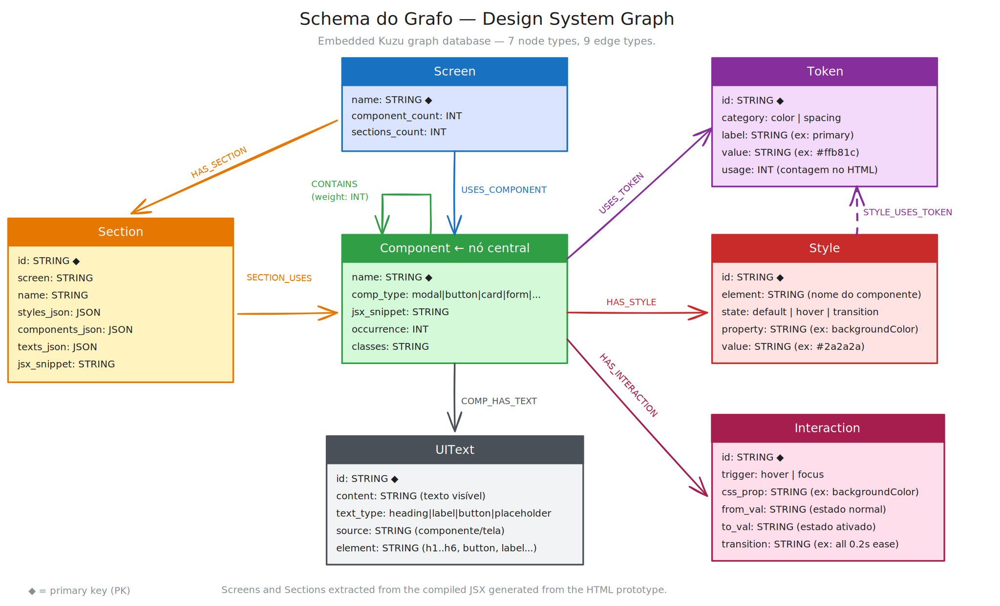

# design-graph

[](https://github.com/manorfm/design-graph/actions/workflows/tests.yml)
[](https://www.python.org/downloads/)
[](https://opensource.org/licenses/MIT)
[](https://github.com/manorfm/design-graph/tags)

`design-graph` was built to solve a specific problem: **standalone HTML prototypes generated by Claude Artifacts and Cursor Composer** are self-contained bundles that embed compiled React, styles, and all assets in a single file. They're great for sharing — but passing them raw to an LLM to implement costs 50–200k tokens per request and forces the model to infer structure from noise.

`design-graph` parses that HTML into a typed knowledge graph and exposes it through MCP — giving agents surgical access to screens, components, design tokens, and interactions at a fraction of the token cost.

> **Typical cost:** raw HTML → 50–200k tokens. `get_component('SectionCard')` → ~300 tokens.

---

## Requirements

- Python 3.9 or later
- `pip` (comes with Python)
- Cursor, Claude Code, or any MCP-compatible client

---

## Install

```bash
pip install git+https://github.com/manorfm/design-graph.git
```

This installs three commands globally: `design-graph`, `design-mcp`, and `design-query`.  
Dependencies (`beautifulsoup4`, `kuzu`) are installed automatically.

To verify:

```bash
design-graph --help
```

---

## Step 1 — Build the graph

Navigate to the folder where your prototype HTML lives and run:

```bash
design-graph myapp.html
```

That's it. The graph is saved automatically to:

```
~/.local/share/design-graph/myapp.db
```

You can build multiple prototypes — each gets its own `.db` file named after the HTML:

```bash
design-graph app-v1.html    # → ~/.local/share/design-graph/app-v1.db
design-graph admin.html     # → ~/.local/share/design-graph/admin.db
```

**Options:**

| Flag | Description |
|---|---|
| `--db <path>` | Save to a custom location instead of the default directory |
| `--diff` | Show what changed since the last build |
| `--force` | Force a full rebuild even if the HTML hasn't changed |

If you run the same command again on an unchanged file, the build is skipped (MD5 hash check). Use `--force` to override.

---

## Step 2 — Configure the MCP server

Add the following to your MCP config file. No paths, no env vars — the server finds the graphs automatically.

**Cursor** → `~/.cursor/mcp.json`

**Claude Code** → `~/.claude/claude_desktop_config.json`

```json
{
  "mcpServers": {
    "design-graph": {
      "command": "design-mcp"
    }
  }
}
```

Restart Cursor / Claude Code after saving the config.

### What happens on startup

The server scans `~/.local/share/design-graph/` for `.db` files and loads them all. During the MCP handshake it announces the available prototype names:

```
[design-graph] Started — 2 prototype(s): app-v1, admin
```

If no graphs are found yet, the server starts in **degraded mode** — it keeps running so the MCP connection stays alive, and every tool call returns a setup instruction:

```
No graphs loaded. Build one first:
  design-graph <prototype.html>
Looking in: /Users/you/.local/share/design-graph
```

### Custom graph directory

If you want to store graphs somewhere else (e.g. a shared folder), set `GRAPH_DIR`:

```json
{
  "mcpServers": {
    "design-graph": {
      "command": "design-mcp",
      "env": { "GRAPH_DIR": "/path/to/your/graphs" }
    }
  }
}
```

---

## Step 3 — Query from your editor

Once the MCP server is running, your agent can call the tools directly. You can also query from the terminal without any editor:

```bash
design-query screens                    # list all screens across all prototypes
design-query tokens color               # list color design tokens
design-query search "button"            # search components, screens, tokens, texts
design-query inspect SectionCard        # full component details
design-query impact SectionCard         # what breaks if this component changes
design-query screen RestaurantsPage     # full screen composition
```

---

## MCP tools reference

| Tool | What it returns | Key params |
|---|---|---|
| `list_screens` | All screens grouped by prototype | — |
| `get_screen` | Sections, components, texts and styles of a screen | `name`, `doc` |
| `get_section` | Details of a named visual section inside a screen | `screen`, `section`, `doc` |
| `list_components` | All components sorted by occurrence, optionally filtered by type | `comp_type?`, `doc` |
| `get_component` | JSX snippet, styles, tokens, interactions, texts | `name`, `doc` |
| `get_component_spec` | Full component spec: styles by state, tokens, texts, parents, children, screens | `name`, `doc` |
| `get_tokens` | Color and spacing design tokens | `category?`, `doc` |
| `find_token_usage` | Where a given token value is used | `value`, `doc` |
| `search` | Cross-entity search (supports PT/EN aliases) | `query` |
| `impact` | Screens and sections affected by changing a component or token | `name`, `doc` |
| `get_full_jsx` | Full unsanitized JSX for a component | `name`, `doc` |
| `get_component_interactions` | Hover/focus states with CSS transitions | `name`, `doc` |
| `set_prototype` | Set or check the active prototype for this session | `name?` |

### The `doc` parameter

When more than one prototype is loaded, use `set_prototype` once at the start of a session, or pass `doc=` per call. The value is the `.db` filename without extension — the same name printed at startup.

The server resolves which prototype to use in this order:

1. **`doc=`** on the tool call — one-off override, always wins
2. **`set_prototype`** tool — set once at the start of a session
3. **`DESIGN_GRAPH_DOC`** env var — permanent default in the MCP config
4. **Auto-select** — when only one prototype is loaded, nothing needs to be set

```
# Option A: set once for the whole session
set_prototype(name='app-v1')
→ get_component(name='SectionCard')           ✓ uses app-v1
→ get_screen(name='HomePage')                 ✓ uses app-v1

# Option B: one-off override regardless of active selection
get_component(name='SectionCard', doc='admin')  ✓ uses admin for this call only

# Option C: permanent default in mcp-config.json
{ "env": { "DESIGN_GRAPH_DOC": "app-v1" } }
```

If multiple prototypes are loaded and none is selected, the tool returns a clear message:

```
Multiple prototypes loaded: 'app-v1', 'admin'
Call set_prototype(name='...') to set the active prototype for this session,
or pass doc= to this specific call.
```

---

## Multiple prototypes

```bash
# Build each prototype once, from wherever the HTML lives
design-graph app-v1.html
design-graph admin.html

# Server loads both automatically — no config change needed
# Use set_prototype or doc= to target the right one
```

Both graphs live in `~/.local/share/design-graph/`. The server finds them on startup without any additional configuration.

---

## Makefile shortcuts

If you cloned the repo and prefer `make`:

```bash
make build   PROTO=myapp.html     # build / update graph
make rebuild PROTO=myapp.html     # force full rebuild
make diff    PROTO=myapp.html     # show what changed since last build

make start                        # start MCP server in background
make stop                         # stop MCP server
make restart                      # restart MCP server
make status                       # check if running
make logs                         # tail server logs

make screens                      # list all screens
make tokens                       # list color tokens
make search  Q='button'           # search the graph
make inspect C='SectionCard'      # component details
make impact  C='SectionCard'      # impact analysis
make screen  S='RestaurantsPage'  # screen composition
```

---

## Why graphs are efficient for agents

### Surgical context, not flooding

| Approach | Tokens | What the LLM gets |
|---|---|---|
| Raw HTML | 50–200k | Infers structure from noise |
| Vector search chunks | ~2k | May be wrong context |
| `get_component('SectionCard')` | ~300 | Exact JSX + styles + tokens |

### Graph traversal replaces inference

Each tool runs a Cypher query that crosses multiple relationships in one call:

```
impact('SectionCard')
→ Component → Screen, Component → Section, Component → Token
→ 4 affected screens, 2 dependent tokens — in a single round-trip
```

### Typed data, no guessing

`get_tokens(category='color')` returns `primary = #ffb81c (47 uses)`. The agent doesn't infer the primary color from scattered CSS — it reads a fact.

Every CSS property is stored in `Style` with an explicit state (`default | hover | transition`), not buried in JSX. Token linkage works at two levels: component-level (`USES_TOKEN`) and property-level (`STYLE_USES_TOKEN`) — so the agent can see exactly which CSS property uses a given token value.

Tailwind utility classes (`flex`, `gap-4`, `rounded-lg`, …) and custom CSS rules are resolved into `Style` nodes during the build, so `className` information is not lost.

### Fuzzy match + PT/EN aliases

`search('botão')` expands to `['btn', 'button', 'Button']` automatically.  
`get_component('Button')` resolves to `BtnPrimary` without an extra call.

### Incremental builds

The builder hashes the HTML before processing. Unchanged files are skipped. A full rebuild of a large prototype takes ~5 seconds.

### Sanitized JSX with typed markers

Event handlers and large expressions are collapsed. Dynamic rendering patterns are replaced with typed markers that preserve structural information:

- `{items.map(i => <CartItem />)}` → `{[list:CartItem]}`
- `{isOpen && <Modal />}` → `{[conditional:Modal]}`
- `{ok ? <SuccessCard /> : <ErrorBanner />}` → `{[either:SuccessCard|ErrorBanner]}`

The agent receives visual structure in ~20 lines instead of 400, and marker-referenced components are still captured in the CONTAINS graph.

---

## Graph schema



> Editable source: [`diagram.excalidraw`](./diagram.excalidraw)

### Nodes

| Node | Properties |
|---|---|
| `Screen` | name (PK), component_count, sections_count |
| `Section` | id (PK), screen, name, styles_json, components_json, texts_json, jsx_snippet |
| `Component` | name (PK), comp_type, jsx_snippet, occurrence, classes |
| `Token` | id (PK), category (color\|spacing), label, value, usage |
| `Style` | id (PK), element, state (default\|hover\|transition), property, value |
| `Interaction` | id (PK), trigger (hover\|focus), css_prop, from_val, to_val, transition |
| `UIText` | id (PK), content, text_type (heading\|label\|button\|placeholder), source, element |

### Edges

```
Screen    ──USES_COMPONENT──►  Component
Screen    ──HAS_SECTION──────►  Section
Section   ──SECTION_USES─────►  Component
Component ──CONTAINS─────────►  Component   (weight = co-occurrence count)
Component ──HAS_STYLE────────►  Style
Component ──USES_TOKEN───────►  Token        (component-level)
Component ──COMP_HAS_TEXT────►  UIText
Component ──HAS_INTERACTION──►  Interaction
Style     ──STYLE_USES_TOKEN──►  Token        (property-level, exact + substring match)
```

---

## File structure

```
.
├── build_graph.py             # HTML → Kuzu graph builder  (CLI: design-graph)
├── mcp_server.py              # MCP server                 (CLI: design-mcp)
├── query.py                   # Terminal query interface   (CLI: design-query)
├── _paths.py                  # Shared path resolution (env → config → XDG)
├── extract_design_system.py   # Alternative: markdown extraction
├── watch_prototype.sh         # fswatch wrapper for live reload
├── Makefile                   # Convenience shortcuts (clone-based workflow)
├── pyproject.toml             # Package config + CLI entry points
├── mcp-config.example.json    # Minimal MCP config template
├── schema.svg                 # Graph schema diagram
└── diagram.excalidraw         # Editable diagram source

~/.local/share/design-graph/   # Default graph storage (created automatically)
  ├── myapp.db                 # One .db per prototype
  └── admin.db
```

---

## License

MIT
