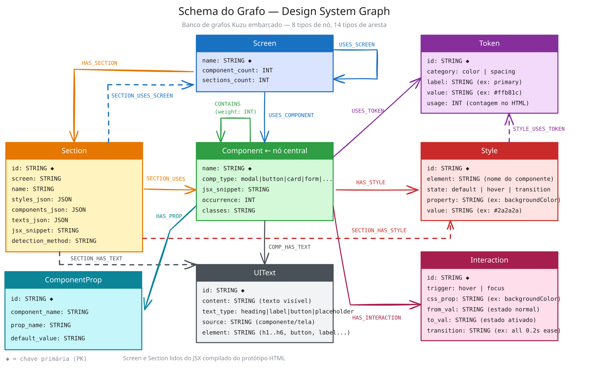

# design-graph

[](https://github.com/manorfm/design-graph/actions/workflows/tests.yml)
[](https://github.com/manorfm/design-graph/actions/workflows/security.yml)
[](https://www.python.org/downloads/)
[](https://opensource.org/licenses/MIT)
[](https://pypi.org/project/design-graph/)

`design-graph` parses standalone HTML prototypes into a typed Kuzu knowledge graph and exposes screens, sections, components, props, styles, design tokens, interactions, text, layout and screen-to-screen navigation through a CLI and an MCP server.

Instead of sending a 50–200k-token HTML bundle to an agent, the agent can request only the component or screen context it needs.

## Supported prototypes

| Format | Recognized by | What becomes a component |
|---|---|---|
| Single-file HTML — bundled React (Claude Artifacts, Cursor Composer), Tailwind or plain HTML | Any HTML document | React component functions, or repeating DOM patterns in plain HTML |
| DC canvas — a canvas of boards, each a DC page (`<x-dc>` template + logic class) | A bundle whose template lays out `about:blank#…` boards | Structures repeated on 3+ pages, and `<sc-for>` loop items |

Every format lands in the same graph and is read through the same tools. Each stored source keeps its own language (`jsx`, `html`, `html-template`), so a response always shows code as it was written.

## Architecture

```text
capture/ (one per format)  ──►  model/ (entities + graph)  ◄──  interface/ (CLI, MCP)
                                        ▲
                            pipeline/ (read → capture → write)
```

- **Capture** reads one family of formats and produces model entities. It never touches the graph, the CLI or the MCP server.
- **Model** is the design vocabulary — screens, sections, components, styles, tokens (with modes), texts, interactions, navigation and variants — plus its Kuzu storage. It depends on nothing else in the package, and each graph records the model version and capture it was built with.
- **Interface** turns model reads into Markdown or terminal output; it never imports a capture.

Adding a format means adding a package under `capture/` and one line to `capture/registry.py` — no change to the model or the interfaces. Architecture tests in `tests/test_architecture_guardrails.py` enforce these boundaries.

## Requirements

- Python 3.10 or later
- `pip` or `pipx`
- An MCP-compatible client only if you intend to use `design-mcp`

Runtime dependencies (`beautifulsoup4`, `kuzu` and `mcp`) are installed automatically.

## Install

From PyPI:

```bash
python3 -m pip install design-graph
```

For an isolated command-line installation:

```bash
pipx install design-graph
```

To track the latest commit on `main` instead of the last published release:

```bash
python3 -m pip install git+https://github.com/manorfm/design-graph.git
pipx install git+https://github.com/manorfm/design-graph.git
```

This installs three commands:

- `design-graph` — build, validate, inspect and export graphs
- `design-query` — query graphs from the terminal
- `design-mcp` — expose graphs to MCP clients over stdio

Verify the installation:

```bash
design-graph --version
design-graph --help
design-query --help
design-mcp --help
```

### Upgrade

```bash
python3 -m pip install --upgrade design-graph
```

With `pipx`:

```bash
pipx upgrade design-graph
```

Installed from the git URL instead? Use `pip install --upgrade git+https://github.com/manorfm/design-graph.git` (or `pipx upgrade` still works, since pipx remembers the source).

> [!IMPORTANT]
> Graphs record the model version they were written in. After an upgrade that changes the model, `design-graph` rebuilds an outdated graph on the next build instead of skipping it, and `design-mcp` refuses to load it until then — run `design-graph --force <prototype.html>` once per prototype. An editable install (`pip install -e .`) must also be reinstalled whenever the command entry points move.

This package now requires Python 3.10+ (the `mcp` SDK dependency doesn't support 3.9). If `python3`/`pipx` resolve to an older interpreter, the upgrade fails to resolve dependencies — install or point `pipx` at a 3.10+ interpreter first (e.g. `pipx install --python python3.11 ...`).

### Uninstall

```bash
python3 -m pip uninstall design-graph
```

Or, if installed with `pipx`:

```bash
pipx uninstall design-graph
```

Uninstalling the package does not delete generated databases. Remove those separately from the configured graph directory if they are no longer needed.

### Local clone, installed globally (no venv)

```bash
git clone https://github.com/manorfm/design-graph.git
cd design-graph
python3 -m pip install -e .
```

This installs `design-graph`, `design-query` and `design-mcp` as global commands backed directly by this clone (an editable install just points at `src/`, it doesn't copy files).

To update, pull and reinstall:

```bash
cd design-graph
git pull
python3 -m pip install -e . --no-deps
```

`--no-deps` skips reinstalling `beautifulsoup4`/`kuzu` and is safe unless `pyproject.toml` added a new dependency. Reinstalling replaces the old version metadata in place — `pip` uninstalls the previous editable version automatically, so nothing stale is left behind. `git pull` alone is not enough to fix `--version` output, since the version string is baked into package metadata at install time, not read from git at runtime.

### Development installation

```bash
git clone https://github.com/manorfm/design-graph.git
cd design-graph
python3 -m venv .venv
source .venv/bin/activate
python3 -m pip install -e '.[dev]'
pytest
```

To measure how much of a prototype the MCP tools let an agent recover — indexed text and readable style coverage, the characters needed to assemble every screen, announced cuts, search answers and build time — run `make bench PROTO=prototype.html`. Reports are written to `.bench/` (git-ignored, since they contain prototype content).

## Build a graph

```bash
design-graph prototype.html
```

By default the graph is written to:

```text
~/.local/share/design-graph/prototype.db
```

Each source file gets its own database based on the HTML filename.

```bash
design-graph app-v1.html
design-graph admin.html
```

Build options:

| Option | Description |
|---|---|
| `--db PATH` | Write to a custom database path |
| `--name NAME` | Write to `<name>.db` under the graph directory |
| `--diff` | Show changes since the previous build |
| `--force` | Rebuild even when the HTML hash is unchanged |
| `--verbose` | Show debug-level pipeline logs |
| `--quiet` | Suppress output except errors |
| `--json` | Emit machine-readable build output for CI |
| `--version` | Print the installed version |

Use `--db` when you want to choose the exact file path. Use `--name` when you want the CLI to keep the standard graph directory but change the database filename.

Builds are incremental. An unchanged HTML file is skipped unless `--force` is supplied.

Each database owns an independent state file named `<database>.state.json`. Builds, diffs and `--force` therefore affect only their target prototype. When an old shared `.graph-state.json` exists, it is migrated only if the directory contains a single database.

If two HTML files have the same filename stem, they resolve to the same default database. The CLI warns when that database was previously built from a different source; use `--db` to keep both.

Use `--name` when you want the generated database to be named explicitly, for example:

```bash
design-graph prototype.html --name "Admin Panel"
```

This produces `Admin Panel.db` inside the resolved graph directory.

A build takes an exclusive lock on its target database. A second build started against the same database while one is already running (e.g. a watch script overlapping a manual build) fails fast with a clear error instead of corrupting the database. If a build reports non-zero `write_errors` in its summary or `--json` output, the graph may be missing nodes or edges — rerun with `--verbose` for details.

## Additional `design-graph` commands

### Export AI-ready chunks

```bash
design-graph chunk prototype.html
design-graph chunk prototype.html --output context.jsonl --max-chars 8000
```

The default output is `<prototype>.jsonl` beside the input file. The default maximum chunk size is 12,000 characters.

### Inspect graph status

```bash
design-graph status
design-graph status --doc "prototype"
design-graph status --db /path/to/prototype.db --verbose
```

With multiple databases, select one using `--doc`, `--db`, `DESIGN_GRAPH_DOC`, or `design-graph db use`.

Status separates fully extracted components from unresolved references. `Components` is the total,
while `Extracted` and `Unresolved` explain how that total was formed.

### Validate graph integrity

```bash
design-graph validate
design-graph validate --doc "prototype"
design-graph validate --db /path/to/prototype.db
design-graph validate --json
```

Validation checks database readability and graph integrity conditions such as orphan components and unused tokens. It exits with status 1 when errors are found.

### Generate a Markdown report

```bash
design-graph report
design-graph report --doc "prototype"
design-graph report --db /path/to/prototype.db --output report.md
design-graph report --name "Admin" --no-tokens
```

Without `--output`, the report is written to stdout.

### List and select databases

```bash
design-graph db list
design-graph db list --json
design-graph db current
design-graph db use "app-v1"
design-graph db info "app-v1"
design-graph db remove "old-prototype"
design-graph db remove "old-prototype" --force
design-graph db prune --dry-run
design-graph db prune
```

`db use` persists `default_doc` in the user configuration. Database names are filenames without the `.db` suffix.

`db remove` deletes the selected database, its `<database>.state.json`, and any interrupted build directory owned by it. It asks for confirmation unless `--force` is supplied. If the removed database was the configured default, only `default_doc` is cleared; other settings are preserved.

`db prune` removes per-database state files whose database no longer exists and interrupted build directories older than one hour. Use `--dry-run` to inspect the plan without deleting anything. Stop MCP or other processes holding the database before removal.

### Configure the UI-context skill in a consuming project

`design-graph` ships a project-agnostic agent skill — a set of instructions that makes an agent working on a frontend project check design-graph for screen/component context before writing UI code, instead of reading the whole prototype HTML. Configure it for one or more AI coding tools with:

```bash
cd /path/to/your-frontend-project
design-graph init                          # interactive: pick tools from a menu
design-graph init --tool claude,cursor     # non-interactive: install for specific tools
design-graph init --tool all               # install for every supported tool
design-graph init --force                  # overwrite a copy you edited by hand
```

Without `--tool`, the interactive prompt uses a real arrow-key/checkbox menu when [`questionary`](https://pypi.org/project/questionary/) is installed (`pip install design-graph[interactive]` or `pipx inject design-graph questionary`) and stdin/stdout are a real terminal; otherwise it falls back to a plain numbered text prompt — both work the same from a script or CI as long as `--tool` is passed, since neither path runs then.

Each tool gets its own native format and location, adapted from a single canonical source so the five copies can't drift out of sync with each other:

| Tool | File | Format |
|---|---|---|
| Claude Code | `.claude/skills/design-graph-ui-context/SKILL.md` | `name`/`description` frontmatter, loaded when relevant to the task |
| Cursor | `.cursor/rules/design-graph-ui-context.mdc` | `description`/`globs`/`alwaysApply` frontmatter, loaded when relevant |
| Codex CLI | `AGENTS.md` (project root) | Plain Markdown, always loaded — appended inside a marked section, never overwrites the rest of the file |
| Google Antigravity | `.agents/rules/design-graph-ui-context.md` | Plain Markdown, always loaded |
| Kiro | `.kiro/steering/design-graph-ui-context.md` | `inclusion: always` frontmatter, always loaded |

`design-graph init` never silently overwrites a copy you've customized — it refuses with a clear message unless `--force` is passed. Re-running it with no changes is a no-op.

Run `design-graph <command> --help` for the complete options of a command.

## Graph directory configuration

The graph directory is resolved in this order:

1. `GRAPH_DIR` environment variable
2. `graph_dir` in the user configuration file
3. `$XDG_DATA_HOME/design-graph`, defaulting to `~/.local/share/design-graph`

The user configuration file is `$XDG_CONFIG_HOME/design-graph/config.json`, defaulting to `~/.config/design-graph/config.json`:

```json
{
  "graph_dir": "/path/to/graphs",
  "default_doc": "app-v1"
}
```

`GRAPH_DIR` affects all three commands and overrides the configuration file.

```bash
GRAPH_DIR=/path/to/graphs design-graph prototype.html
GRAPH_DIR=/path/to/graphs design-query screens
```

## Query from the terminal

```bash
design-query screens
design-query --doc "app-v1" screens
design-query --db /path/to/app-v1.db screens
design-query tokens
design-query tokens color
design-query search "primary button"
design-query inspect SectionCard
design-query impact SectionCard
design-query screen RestaurantsPage
design-query interactions BtnPrimary
design-query children CardProduct
design-query metrics
```

`--verbose`, `--doc` and `--db` are accepted before or after the command.

Token filters accepted by `design-query tokens` are `color`, `spacing`, `typography`, `shadow` and `radius`. Without a filter, all categories are returned, including extracted CSS variables.

Every terminal query operates on one selected database. Selection follows this order:

1. `--db PATH`
2. `--doc NAME`
3. `DESIGN_GRAPH_DOC`
4. `default_doc` in the user configuration
5. Automatic selection when exactly one database exists

When multiple databases exist without a selection, the command exits with guidance instead of choosing one silently.

`design-query metrics` is the one exception: it never touches a `.db` file, so it works even when no prototype has been built yet — see [Call metrics](#call-metrics).

## Configure the MCP server

The server scans the configured graph directory for every `*.db` file when it starts. It remains available in degraded mode when no graph exists and returns setup guidance from tool calls.

### Cursor

Add the server to the Cursor MCP configuration (user-level `~/.cursor/mcp.json` or project-level `.cursor/mcp.json`):

```json
{
  "mcpServers": {
    "design-graph": {
      "command": "design-mcp"
    }
  }
}
```

### Claude Code

Register the stdio server with the Claude Code CLI:

```bash
claude mcp add --scope user design-graph -- design-mcp
claude mcp get design-graph
```

For project-shared configuration, use `--scope project`; Claude Code writes a `.mcp.json` file in the project.

### Custom graph directory and default prototype

Environment variables can be passed by the MCP client:

```json
{
  "mcpServers": {
    "design-graph": {
      "command": "design-mcp",
      "env": {
        "GRAPH_DIR": "/path/to/graphs",
        "DESIGN_GRAPH_DOC": "app-v1"
      }
    }
  }
}
```

- `GRAPH_DIR` selects the directory scanned for databases.
- `DESIGN_GRAPH_DOC` sets the default active prototype when multiple databases are loaded.

The server detects a rebuilt `*.db` file on its own (it compares file mtimes before each tool call) and reloads without a restart. Restarting or reconnecting the MCP client is only needed after changing `GRAPH_DIR`, `DESIGN_GRAPH_DOC`, or upgrading the package itself — those are read once, at startup.

## MCP tools

| Tool | Purpose | Parameters |
|---|---|---|
| `list_screens` | List screens across all loaded prototypes | — |
| `get_screen` | Inspect one screen: `detail=outline` (sections and components by name, navigation, variants), `detail=full` (every section and component whole) or `detail=layout` (display/flex/grid and size profiles); `section=` returns that section alone | `name`, `section?`, `detail?`, `doc?` |
| `assemble_page` | Build one screen in one call: header, the screen's skeleton, each component it renders once, the data they repeat, tokens by mode and dependencies — `known` leaves out components the agent already has; long answers come in parts | `name`, `known?`, `part?`, `doc?` |
| `list_components` | List components, optionally filtered by semantic type (capped at 100 by default) | `comp_type?`, `limit?`, `doc?` |
| `get_component` | Return one component, whole — hierarchy, styles by state (incl. responsive), tokens by mode, texts, interactions, props with defaults, referenced data and source; `depth=1..3` adds the components it nests. Falls back to a CSS-class spec when the name is a shared class, and to the screen when it is a screen's name | `name`, `depth?`, `doc?` |
| `get_full` | Return, whole, what another answer shortened — `aspect=source`: a component's or screen's source as the prototype wrote it (in parts, `part=`); `aspect=styles` / `aspect=texts`: the complete style or text list of a component (`name=`) or of a screen section (`screen=` + `section=`); `aspect=data`: the module-level data a component references (e.g. an icon-name → SVG-path table) | `aspect`, `name?`, `screen?`, `section?`, `part?`, `doc?` |
| `get_tokens` | Return color, spacing, typography, shadow, radius or CSS-variable tokens, or all categories when omitted; tokens defined per mode (e.g. light/dark theme) show their mode | `category?`, `screen?`, `mode?`, `doc?` |
| `get_asset` | Write the files of one embedded font family or image into `design-graph-assets/<name>/` in the workspace and return their paths — content checked against its hash, names never taken from the prototype | `name`, `doc?` |
| `get_resources` | List what the prototype loads besides its markup — libraries with version and origin, fonts with weights and subsets, images, the design tool's runtime and the prototype's own modules — described, never embedded | `kind?`, `screen?`, `doc?` |
| `find_token_usage` | Find components and screens using a token | `value`, `doc?` |
| `search` | Search screens, components, tokens, text and shared CSS classes across prototypes | `query` |
| `impact` | Find screens and sections affected by a component or token | `name`, `doc?` |
| `get_build_diff` | Return screens/components added or removed since the previous build, plus a warning when any bundle entry failed to decode and was dropped from that build | `doc?` |
| `validate_component_implementation` | Compare a component source you wrote against its stored spec (children, default-state styles, texts), read by the capture the prototype was built with | `name`, `source`, `doc?` |
| `set_prototype` | Set or inspect the active prototype for this MCP connection — resets on a connection restart (e.g. a client `/mcp` reconnect), even mid-task | `name?` |
| `get_metrics` | Return usage metrics for this server's own tool calls — see [Call metrics](#call-metrics) | `doc?`, `tool?`, `outcome?`, `since?`, `until?`, `limit?`, `raw?` |

`get_tokens.category` accepts `color`, `spacing`, `typography`, `shadow`, `radius` and `css_var`. Omit `category` to retrieve every extracted category. `mode` keeps that mode's values plus the tokens shared by every mode.

`list_screens`, `get_screen` and `assemble_page` also show each screen's viewport, where it navigates to and is reached from, and which screen it is a variant of (another viewport or mode).

`validate_component_implementation` is best-effort, not a full re-extraction: it reliably catches missing/extra child components and missing inline styles/texts, but cannot verify styles that came from the prototype's own stylesheet classes or utility classes (e.g. `bg-blue-500`) — those require the original stylesheet, unavailable for a standalone fragment. Treat a clean report as "no red flags found", not proof of a pixel-perfect match. `source` is capped at 20,000 characters.

Capture never drops anything for size: every style, interaction, class, prop, text and source is stored whole. A long source comes back from `get_full(aspect="source")` in parts (`part=`), each naming the call for the next one. A style, text or "Dados referenciados" table that ends in a `+N mais` notice is a display-time cut, not missing data, and always names the exact `get_full` call that recovers the rest. Pass `screen` to scope the list to tokens that screen's own components actually use.

A component's spec can include a "Dados referenciados" ("Referenced data") section: the literal content of any module-level constant its own body references by name — e.g. an icon-name -> SVG-path table indexed as `ICONS[name]`, or a role-key -> badge metadata table. Reuse those exact values when reimplementing a component instead of substituting a different icon or asset — `get_full(name=…, aspect="data")` returns the whole table.

### Prototype selection

When multiple databases are loaded, the server selects a prototype in this order:

1. `doc` passed to the current tool call
2. Prototype selected by `set_prototype`
3. `DESIGN_GRAPH_DOC`
4. `default_doc` from the user configuration
5. Automatic selection when only one prototype is loaded

```text
set_prototype(name="app-v1")
get_component(name="SectionCard")
assemble_page(name="HomePage", doc="admin")
```

The `doc` value is the database filename without `.db`.

## Call metrics

Every call made through the MCP server (`dispatch_tool_call`) is logged as one JSON line to `metrics.jsonl` in the XDG data directory — always `$XDG_DATA_HOME/design-graph` (`~/.local/share/design-graph` by default), regardless of any `GRAPH_DIR`/`graph_dir` override used for `.db` files (see [Graph directory configuration](#graph-directory-configuration)): the log's location doesn't move with the graph directory. Each line records the tool name, the active prototype, an outcome, duration and the call's own arguments. `design-query`'s other commands talk to the graph directly and are not logged — only calls that went through the MCP server are.

Outcome is classified from the tool's own rendered response: `error` for a raised exception, `not_found` / `ambiguous` / `no_results` from the same phrasing every tool already uses for those cases, `ok` otherwise. This is a heuristic read on the response text, not a separate contract — a tool that changes its wording could fall through to `ok`.

Read the log back with the `get_metrics` MCP tool or `design-query metrics` — both take the same filters and read the same file:

```bash
design-query metrics
design-query metrics --tool search --outcome no_results
design-query metrics --doc "app-v1" --since 24h
design-query metrics --raw --limit 20
```

| Parameter | Meaning |
|---|---|
| `doc` | Filter to calls tagged with this prototype |
| `tool` | Filter to calls of one tool (e.g. `search`) |
| `outcome` | `ok`, `not_found`, `ambiguous`, `no_results` or `error` |
| `since` / `until` | ISO-8601 timestamp or relative shorthand (`24h`, `7d`, `30m`) |
| `limit` | Max rows shown with `raw=true` — never affects the aggregate below |
| `raw` | Return the raw call list instead of the aggregate summary |

The default output is an aggregate summary: counts per tool and outcome, an overall not-ok rate, a per-prototype breakdown, and the search queries that most often returned nothing — the fastest way to see where search coverage is actually failing in real usage, not just in a hand-picked example:

```text
## Métricas de uso
(342 chamadas)

| Ferramenta | Total | ok | not_found | ambiguous | no_results | error |
|---|---|---|---|---|---|---|
| search | 128 | 96 | 0 | 6 | 26 | 0 |
| get_component_spec | 74 | 68 | 6 | 0 | 0 | 0 |
| list_components | 30 | 30 | 0 | 0 | 0 | 0 |

**Taxa não-ok:** 14.6%

### Por prototype
| Prototype | Total | Taxa não-ok |
|---|---|---|
| app-v1 | 210 | 12.4% |
| admin | 132 | 18.2% |

### Buscas sem resultado (top)
| Query | Ocorrências |
|---|---|
| botao cinza | 6 |
| modal confirmação | 4 |
```

Set `DESIGN_GRAPH_METRICS_DISABLED=1` to turn logging off entirely.

## Extracted capabilities

**Every prototype**

- Screens, sections and reusable components, with hierarchy in render order and occurrence counts
- Default, hover and focus styles; component- and property-level token linkage, including `var(--x)` references to custom-property tokens in every mode
- Color, spacing, typography, shadow, radius and CSS-variable tokens, with light/dark (or any other) modes
- UI text with semantic types (heading, button, label, description, tooltip)
- Screen viewports, navigation between screens and screen variants (another viewport or mode)
- Every source stored whole and exactly as written, with its language — long sources are paged by the tools, never cut
- Layout profiles for flex/grid and dimensions, per component and per section selector
- Fuzzy matching and Portuguese/English search aliases
- Best-effort validation of agent-written sources against a component's stored spec
- Incremental builds, exclusive per-database write locks, model-version checks, graph diffs, validation and JSON output for CI
- AI-ready JSONL chunks and Markdown reports

**Single-file HTML (React, Tailwind, plain HTML)**

- Embedded libraries (React, ReactDOM, …), the in-browser compiler (Babel standalone), fonts and images identified as resources with name, version and origin — only the prototype's own modules are read as its code
- Visual-function filtering that excludes non-rendering React/Babel runtime internals, and lexical scanning that handles destructured parameters, strings, templates and comments
- Semantic screen roles that keep forms, tabs, sections and modals as components unless they are true navigation surfaces
- Sections detected from padding/margin-heavy containers, whether the padding is inline or class-resolved
- Consolidation of same-named definitions without dropping props, source, styles or child references
- Tailwind utility and custom CSS class resolution, attributed per selector; shared classes stay discoverable via search and `get_component`
- Each component's and screen's whole function as its source — hooks, handlers, lists and conditions included; children rendered behind lists, conditions and ternaries still linked
- Module-level data a component references (e.g. icon tables) attached verbatim
- External/library component references kept visible instead of dropped

**DC canvas**

- One screen per board, named by its title, with the board's viewport; boards titled `Base (…)` become variants of `Base`
- Page links (`A02-….dc.html`, `Main.dc.html`) resolved to the boards they number
- Custom properties per theme selector, named after the enum option (e.g. `tema`: claro/escuro) that switches them on
- Page blocks as sections, components inferred from structures repeated across pages and from `<sc-for>` loop items, with the literal list a loop repeats attached as referenced data
- `<sc-for>`, `<sc-if>` and `<sc-raw-*>` read without rewriting the stored template
- The inline style of every element, attributed by its path (`ul > li:2 > span`) to the section, component or page that contains it
- What each page loads: the DC runtime, libraries with the CDN URL the bundle declares, and fonts with weights, subsets and a ready `@import` line when they come from Google Fonts

## Graph schema



Editable source: [`diagram.excalidraw`](./diagram.excalidraw).

See [`schema.py`](./src/design_graph/model/graph/schema.py) for the authoritative node and relationship definitions — including the `Model` node (model version and capture), `Screen` viewports and the `NAVIGATES_TO` and `VARIANT_OF` relationships between screens.

## Makefile shortcuts

After installing the package or activating the development environment:

```bash
make build PROTO=prototype.html
make diff PROTO=prototype.html
make rebuild PROTO=prototype.html

make start
make stop
make restart
make status
make logs

make screens
make tokens
make search Q='button'
make inspect C='SectionCard'
make impact C='SectionCard'
make screen S='RestaurantsPage'

make list-graphs
make remove-db DOC='old-prototype'
make prune-dbs
make clean-graph DB=/path/to/prototype.db
make clean-all
```

Developer-oriented targets include `version`, `release` and `bench`. Run `make help` for the complete list.

## Releasing & security

A version is created only when a release is made. `make version` shows the version the next release would get; `make release` publishes it:

```bash
make release
```

It refuses unless you are on `main`, identical to `origin/main`, with a clean working tree and at least one commit that ships something since the last release. The next version is the highest `vX.Y.Z` tag bumped by the strongest change among **every** commit since that release — any type marked breaking with `!` (`feat!:`, `refactor(model)!:`) bumps major, `feat` bumps minor, `fix`/`chore`/`refactor` bump patch, and other types (`docs`, `test`, `ci`) ship nothing on their own. It then tags `main`, pushes the tag and creates the GitHub Release, which triggers the publish pipeline (`.github/workflows/publish.yml`). Nothing reaches PyPI without passing through, in order:

1. **`security.yml`** — CodeQL, Bandit and `pip-audit` (SAST + dependency/SCA scanning). A failing scan blocks the release outright.
2. **`build`** — builds the sdist/wheel.
3. **`publish`** — requires manual approval (the `pypi` GitHub environment has a required reviewer) before publishing to PyPI via trusted publishing (OIDC — no long-lived API token is stored anywhere).

The same `security.yml` also runs on every push and pull request to `main`, so issues surface before merge, not just at release time.

Repository access is locked down so all of this is enforced, not just advisory: branch protection on `main` requires a pull request for anyone other than a repo admin, and a tag ruleset restricts creation/deletion of `v*` tags to admins — so an external contributor can propose changes via PR but cannot push a release or trigger a publish, even by cloning the repo and running `make` locally (the PyPI trusted-publisher credential only exists inside a GitHub Actions run of this exact repository).

## Repository structure

```text
src/design_graph/
├── capture/      # one package per prototype format, plus the contract, registry and bundle reader
│   ├── html_prototype/   # single-file HTML: bundled React, Tailwind, plain HTML
│   └── dc_canvas/        # DC canvases of boards
├── model/        # design entities and the Kuzu graph (schema, writer, reader, catalog)
├── interface/    # CLI (build, query, status, validation, reports, chunks, init) and MCP server
├── pipeline/     # orchestration, progress and incremental state
├── resources/    # packaged agent skill (see `design-graph init`)
└── paths.py      # GRAPH_DIR, user config and XDG resolution

tests/            # unit and integration tests, including architecture guardrails
docs/             # architecture specs, plans and change records
pyproject.toml    # package metadata and CLI entry points
Makefile          # local workflow shortcuts
schema.svg        # graph schema diagram
```
